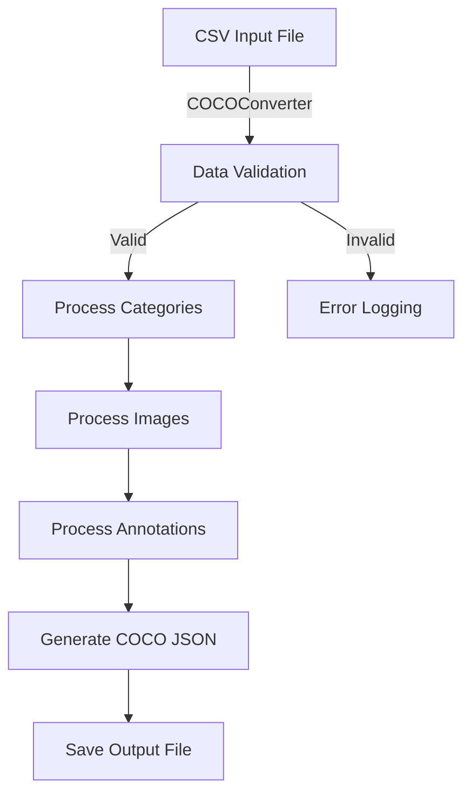
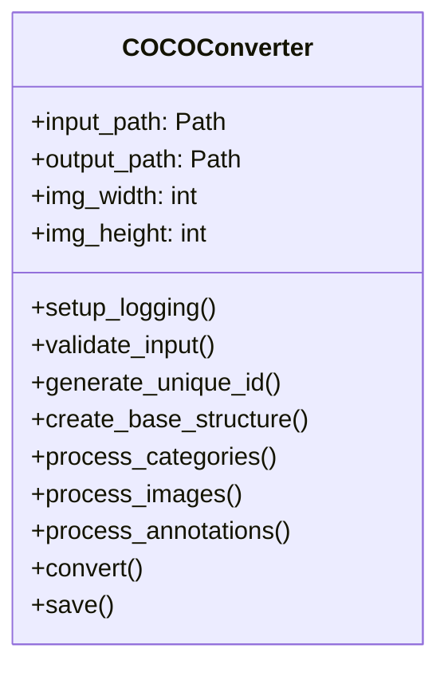
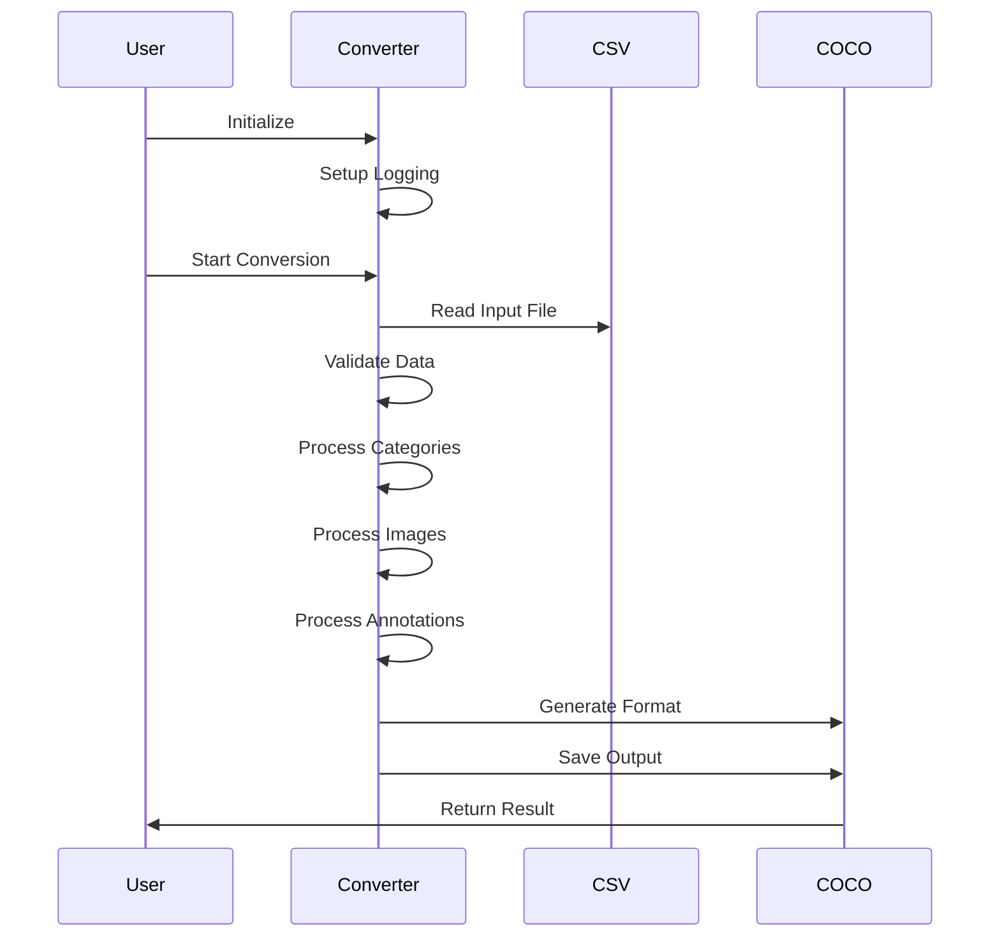

# Advanced Automatic CSV to COCO Format Converter

A robust Python tool for converting CSV annotation files to COCO (Common Objects in Context) JSON format, with comprehensive error handling and logging capabilities.

## 🔍 Overview

This converter transforms CSV files containing object detection annotations into the standardized COCO JSON format, commonly used in computer vision and machine learning tasks.



## ⚙️ Features

- Robust CSV to COCO format conversion
- Comprehensive error handling and logging
- Deterministic unique ID generation
- Support for custom image dimensions
- Metadata enrichment for categories, images, and annotations
- Progress tracking and validation

## 📋 Requirements

- Python 3.6+
- Dependencies:
  - pandas
  - pathlib
  - logging
  - typing

## 🛠️ Installation

```bash
git clone Coral-Reef-Research
pip install -r requirements.txt
cd Coral-Reef-Research
cd Dataset converter from CSV to COCO format
```

## 📊 Input CSV Format

The input CSV file must contain the following columns:

| Column | Description |
|--------|-------------|
| image  | Image filename |
| label  | Object category |
| xmin   | Bounding box left coordinate |
| ymin   | Bounding box top coordinate |
| xmax   | Bounding box right coordinate |
| ymax   | Bounding box bottom coordinate |

## 🔄 Class Structure



## 🔄 Conversion Process



## 📝 Usage

```python
from coco_converter import COCOConverter

# Initialize converter with input and output paths
converter = COCOConverter(
    input_path="input.csv",
    output_path="output.json",
    img_width=2704,
    img_height=1524
)

# Perform conversion
coco_data = converter.convert()

# Save the results
if coco_data:
    converter.save(coco_data)
```

## 📤 Output Format

The converter generates a COCO-format JSON file with the following structure:

```json
{
    "info": {...},
    "licenses": [...],
    "images": [...],
    "annotations": [...],
    "categories": [...]
}
```

## 📋 Logging

The converter maintains detailed logs in:
- Console output
- `conversion.log` file

Log entries include:
- Conversion progress
- Validation results
- Errors and warnings
- Processing statistics

## ⚠️ Error Handling

The converter includes comprehensive error handling for:
- Missing or invalid input files
- Incorrect CSV format
- Invalid bounding box coordinates
- File system operations
- JSON conversion issues

## 🤝 Contributing

Contributions are welcome! Please feel free to submit pull requests.

1. Fork the repository
2. Create your feature branch
3. Commit your changes
4. Push to the branch
5. Create a Pull Request

## 📄 License

This project is licensed under the Appache 2.0 License - see the LICENSE file for details.

## 📞 Support

For support and questions, please open an issue in the GitHub repository.
