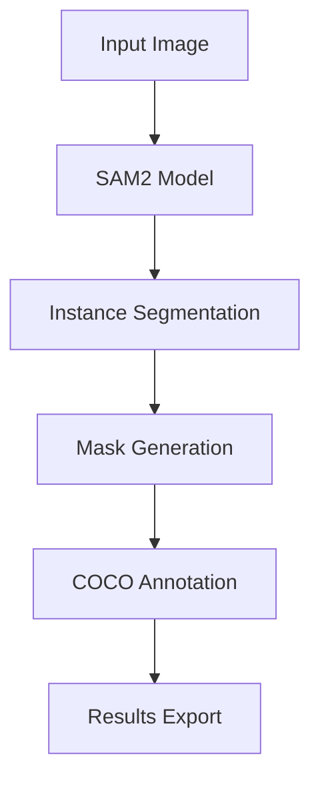
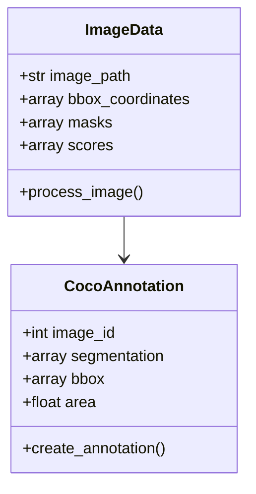

# 🌊 SAM2 Coral Reef Segmentation
> Advanced Computer Vision Analysis for Marine Ecosystem Research using Meta AI's Segment Anything Model 2 (SAM2)


## 📋 Overview

This project implements an advanced instance segmentation pipeline for coral reef imagery analysis, enabling precise delineation and classification of coral species and formations using Meta AI's Segment Anything Model 2 (SAM2).

### 🔄 Pipeline Architecture



## 🚀 Features

- **Automated Segmentation**: Advanced instance segmentation using SAM2
- **Multi-format Export**: COCO JSON and CSV output formats
- **GPU Optimization**: CUDA-accelerated processing
- **Quality Metrics**: IoU and confidence score calculation
- **Batch Processing**: Efficient handling of multiple images

## 🛠️ Installation

```bash
# Clone the repository
git clone https://github.com/Awrsha/Coral-Reef-Research.git
cd Coral-Reef-Research
cd Generate Coral Segmentation with SAM

# Install dependencies
pip install -r requirements.txt

# Download SAM2 checkpoint
wget https://dl.fbaipublicfiles.com/segment_anything_2/072824/sam2_hiera_large.pt
```

## 📊 Data Structure



## 🔍 Usage

```python
# Example usage
from sam2_coral_segmentation import setup_sam2, process_image

# Initialize model
sam2_model, device = setup_sam2()

# Process single image
masks, scores = process_image(image_path, boxes, predictor)
```

## 📁 Project Structure

```
sam2-coral-segmentation/
├── checkpoints/
│   └── sam2_hiera_large.pt
├── src/
│   ├── __init__.py
│   ├── model.py
│   ├── processing.py
│   └── utils.py
├── requirements.txt
└── README.md
```

## 📈 Results

The pipeline generates:
- Instance segmentation masks
- Species classifications
- Statistical analyses
- Visualization outputs

## 🤝 Contributing

Contributions are welcome! Please feel free to submit a Pull Request.

## 📜 License

This project is licensed under the Appache 2.0 License - see the [LICENSE](LICENSE) file for details.

## ✍️ Authors

- **Mahdi Kashani**
- **Amir Mohammad Parvizi**

## 📚 Citation

```bibtex
@software{sam2_coral_segmentation,
    title = {SAM2 Coral Reef Segmentation},
    author = {Kashani, Mahdi and Parvizi, Amir Mohammad},
    year = {2024},
    version = {1.0.0}
}
```
