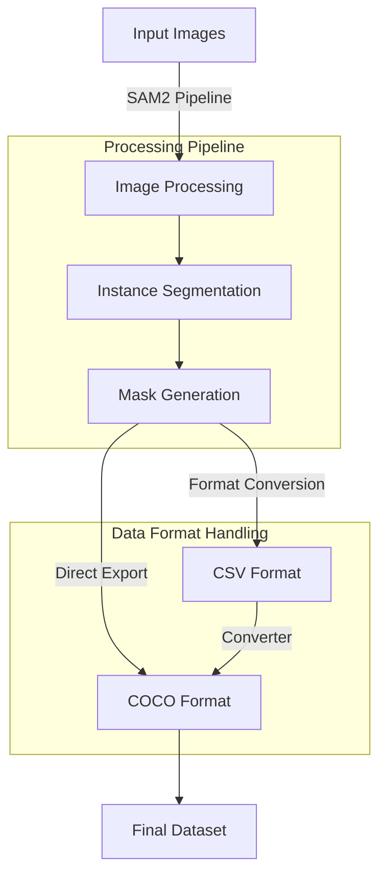
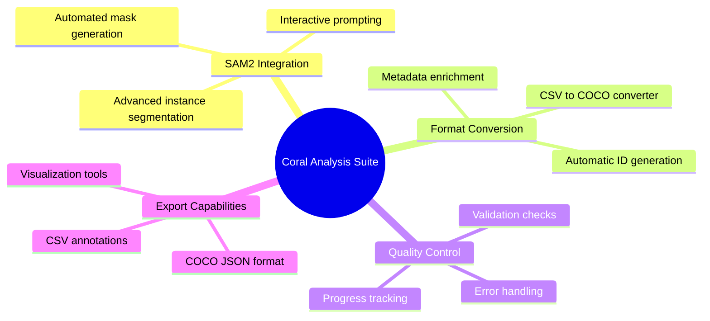
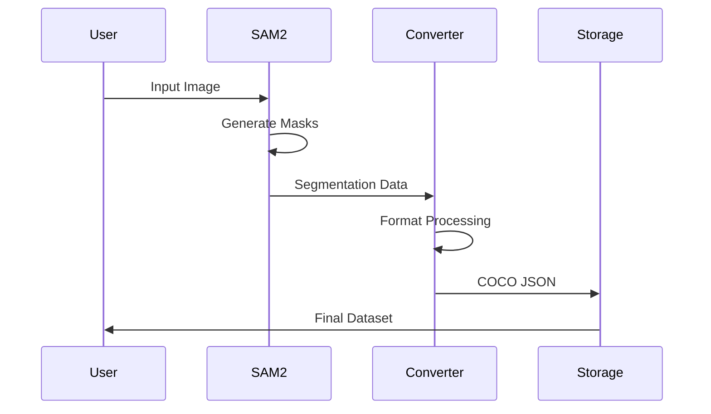

# 🌊 Advanced Coral Reef Analysis with SAM2 & COCO Tools
> An integrated suite for coral reef research combining Meta AI's SAM2 and automated annotation tools

## 🔍 System Architecture


## 🚀 Key Features



## ⚙️ Components

1. **SAM2 Segmentation Engine**   - Instance segmentation
   - Multi-mask output
   - GPU optimization
   - Interactive prompting

2. **Format Converter**
   - CSV to COCO transformation
   - Deterministic ID generation
   - Comprehensive error handling
   - Progress tracking

3. **Visualization Tools**
   - Mask visualization
   - Bounding box display
   - Annotation overlay
   - Quality metrics

## 🛠️ Installation

```bash
# Clone repository
git clone https://github.com/Awrsha/Coral-Reef-Research.git
cd Coral-Reef-Research

# Install dependencies
pip install -r requirements.txt

# Download SAM2 model
wget https://dl.fbaipublicfiles.com/segment_anything_2/072824/sam2_hiera_large.pt -P checkpoints/
```

## 📊 Data Flow


## 💻 Usage Examples

### SAM2 Segmentation
```python
from sam2_coral_segmentation import setup_sam2, process_image

# Initialize model
model, device = setup_sam2()

# Process image
masks, scores = process_image("coral_image.jpg", model)
```

### Format Conversion
```python
from coco_converter import COCOConverter

converter = COCOConverter(
    input_path="annotations.csv",
    output_path="coco_dataset.json",
    img_width=2704,
    img_height=1524
)

coco_data = converter.convert()
converter.save(coco_data)
```

## 📊 Output Formats

### COCO JSON Structure

```json
{
    "info": {"description": "Coral Reef Dataset"},
    "images": [
        {
            "id": 1,
            "width": 2704,
            "height": 1524,
            "file_name": "coral_001.jpg"
        }
    ],
    "annotations": [...],
    "categories": [...]
}
```

## Developers 👨🏻‍💻

<div align="center">
  <table>
    <tr>
      <td align="center">
        <a href="https://github.com/m-kashani">
          
          <br />
          <sub><b>Mahdi Kashani</b></sub>
        </a>
        <br />
        <a href="https://www.linkedin.com/in/m-kashani/">
          
        </a>
      </td>
      <br />
      <td align="center">
        <a href="https://github.com/Awrsha">
          
          <br />
          <sub><b>Amir M. Parvizi</b></sub>
        </a>
        <br />
        <a href="https://www.linkedin.com/in/awrsha/">
          
        </a>
      </td>
    </tr>
  </table>
</div>

## 📄 License

This project is licensed under the Apache 2.0 License - see the [LICENSE](LICENSE) file for details.
