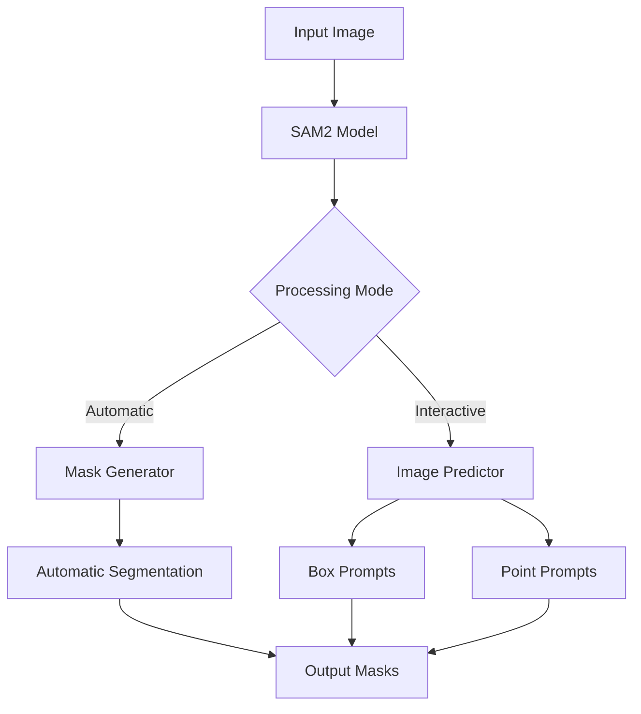
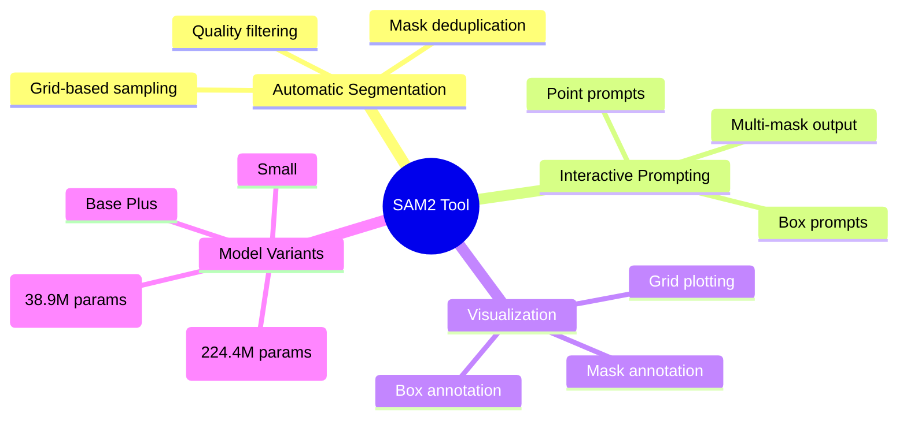
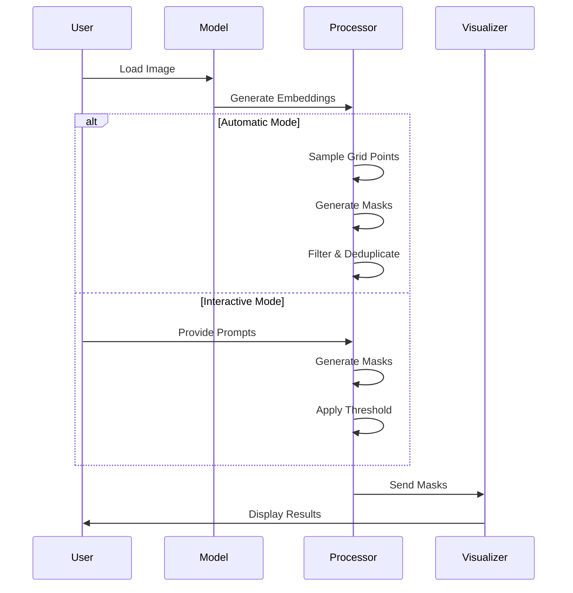

# SAM2 Image Segmentation Tool 🎯

A powerful implementation of Meta's Segment Anything Model 2 (SAM2) for automatic image segmentation and interactive prompting.

[](https://www.python.org/downloads/)
[](https://github.com/facebookresearch/segment-anything-2)

## 🎯 Architecture Overview



## 🚀 Features



## 📋 Requirements

```text
torch>=2.0.0
opencv-python>=4.7.0
numpy>=1.21.0
supervision>=0.14.0
jupyter_bbox_widget>=0.3.0
segment-anything-2>=1.0
```

## 🛠️ Installation

1. Clone the repository:
```bash
git clone https://github.com/facebookresearch/segment-anything-2.git
cd segment-anything-2
pip install -e .
```

2. Install additional dependencies:
```bash
pip install supervision jupyter_bbox_widget
```

3. Download SAM2 checkpoints:
```bash
mkdir checkpoints
wget https://dl.fbaipublicfiles.com/segment_anything_2/072824/sam2_hiera_large.pt
```

## 💻 Usage

### Automatic Mask Generation

```python
from sam2.build_sam import build_sam2
from sam2.automatic_mask_generator import SAM2AutomaticMaskGenerator

# Load model
sam2_model = build_sam2(CONFIG, CHECKPOINT, device=DEVICE)
mask_generator = SAM2AutomaticMaskGenerator(sam2_model)

# Generate masks
sam2_result = mask_generator.generate(image_rgb)
```

### Interactive Prompting

```python
from sam2.sam2_image_predictor import SAM2ImagePredictor

predictor = SAM2ImagePredictor(sam2_model)
predictor.set_image(image_rgb)

# Box prompts
masks, scores, logits = predictor.predict(
    box=boxes,
    multimask_output=False
)

# Point prompts
masks, scores, logits = predictor.predict(
    point_coords=input_point,
    point_labels=input_label,
    multimask_output=True
)
```

## 📊 Processing Pipeline



## ⚙️ Advanced Configuration

### Mask Generator Parameters

| Parameter | Description | Default |
|-----------|-------------|---------|
| points_per_side | Points sampled on image | 32 |
| points_per_batch | Points processed simultaneously | 64 |
| pred_iou_thresh | Mask quality threshold | 0.88 |
| stability_score_thresh | Mask stability threshold | 0.95 |
| crop_n_layers | Number of crop layers | 0 |
| min_mask_region_area | Minimum mask area | 0 |

## 📈 Performance Considerations

- Use CUDA-enabled GPU for optimal performance
- Enable mixed-precision computing for faster processing
- Adjust batch sizes based on available memory
- Consider model size tradeoffs based on requirements

## 🙏 Acknowledgments

- Meta AI for the SAM2 model
- Roboflow for additional tools and examples
- The open-source community
